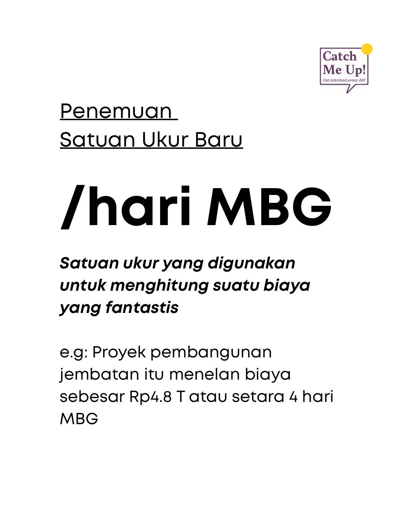

# Hari MBG Converter Raycast Extension

Extension untuk Raycast untuk mengkonversi nominal uang (Rupiah) ke satuan **Hari MBG**

</img>

Referensi: https://x.com/catchmeupco/status/2037414315758952754

## Catatan

1 Hari MBG = Rp 1.200.000.000.000 (1,2 triliun rupiah/hari) ([sumber](https://money.kompas.com/read/2025/09/09/100509626/anggaran-fantastis-mbg-tembus-rp-12-triliun-per-hari))

## Demo

